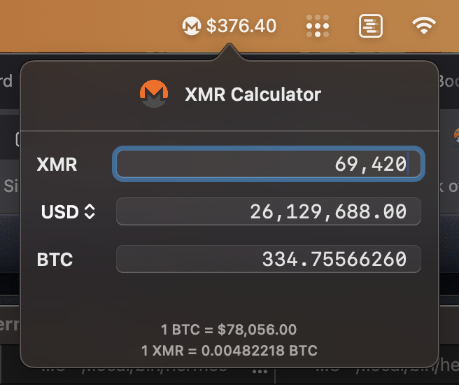

# XMRMenuCalc

A minimal macOS menu bar app that shows live Monero (XMR) price and opens a quick-conversion calculator. No dock icon, no clutter.

## What it does

- Lives in your status bar with the Monero logo
- Shows live XMR price in USD (via CoinGecko)
- Click the icon → popover calculator for XMR / USD / BTC conversions
- Supports 36 fiat currencies

## Screenshot



## Install

### Option 1: Download DMG (easiest)

1. Download `XMRMenuCalc.dmg` from [Releases](../../releases)
2. Open the DMG, drag `XMRMenuCalc` to **Applications**
3. Launch from Applications (or Spotlight: `Cmd+Space`, type `xmr`)
4. Grant **Accessibility** or just approve it in **System Settings → Privacy & Security** if Gatekeeper complains

### Option 2: Build from source

Requires macOS 13+, Xcode command line tools, and Swift 5.9+.

**Build with the included script:**

```bash
git clone <repo-url>
cd XMRMenuCalc
./build.sh
open build/XMRMenuCalc.app
```

**Or build with Swift Package Manager:**

```bash
swift build
.open build/debug/XMRMenuCalc   # terminal binary, no .app bundle
```

**Or open in Xcode:**

```bash
open XMRMenuCalc.xcodeproj
```

Then `Cmd+R` to run, or `Cmd+B` then right-click the product → Show in Finder.

## First launch

Since the app is ad-hoc signed (not notarized), macOS will block it on first open. Right-click the app in Applications and choose **Open**, or go to **System Settings → Privacy & Security** and click **Open Anyway**.

## Uninstall

Drag `XMRMenuCalc.app` from Applications to Trash. No config files are written.

## Support

If you find XMRMenuCalc useful, a suggested donation is **$1 of XMR** to support Monero software development:

- **Kuno fundraiser:** https://kuno.anne.media/fundraiser/ufmp/
- **XMR address:** `489mHXbSehCF5oraCQvmRYSe9mkxyqZ6XJBS8A4af6qzbKBx3b26bLSRUVso9R6PTSgEX7RggVPc5hxcZnAaRKCT7iekvDX`

## License

MIT
